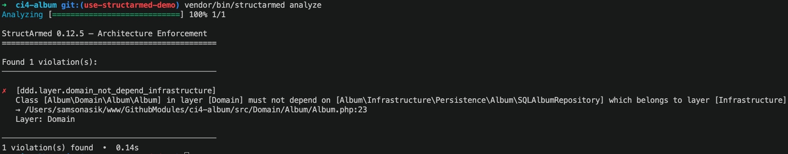

# StructArmed

<p align="center">
    
</p>

<p align="center">
    Configurable PHP architecture guards: define your layers and rules, then keep them enforced.
</p>

[](https://github.com/boundwize/structarmed/releases)
[](https://github.com/boundwize/structarmed/actions/workflows/ci.yml)
[](https://codecov.io/gh/boundwize/structarmed)
[](https://github.com/phpstan/phpstan)
[](https://packagist.org/packages/boundwize/structarmed)


StructArmed turns architecture decisions into executable checks. Start with presets for PSR, MVC, or DDD projects, then tune or extend the rules in native PHP.

<p align="center">
    
</p>

## Documentation

The full documentation now lives in [docs/](docs/index.md) and is ready for GitHub Pages with the `just-the-docs` template.

- Documentation site: <https://boundwize.github.io/structarmed/>
- Local entry point: [docs/index.md](docs/index.md)

## Installation

```bash
composer require --dev boundwize/structarmed
```

## Quick Start

```bash
vendor/bin/structarmed init --preset=psr4
vendor/bin/structarmed analyse
```

See the [quick start guide](docs/quick-start.md) for every preset, the [configuration guide](docs/configuration.md) for project setup, and [custom rules and presets](docs/custom-rules-and-presets.md) for extension points.

## Contributing

Contributions are welcome. See [CONTRIBUTING.md](CONTRIBUTING.md) for setup, tooling, and pull request expectations.

## License

StructArmed is released under the [MIT License](LICENSE).
